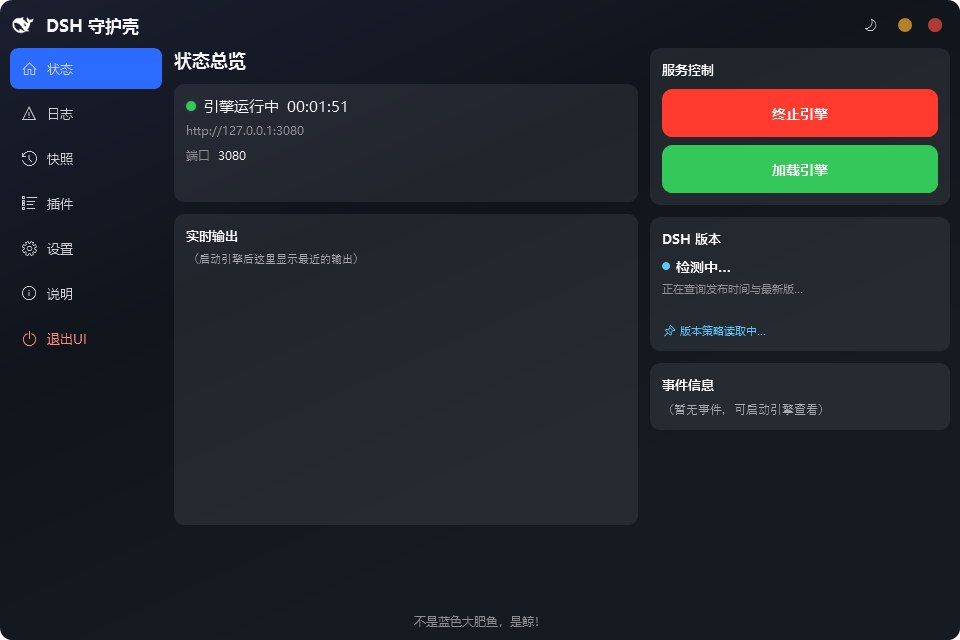
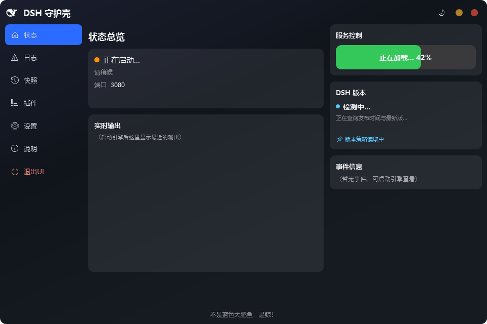
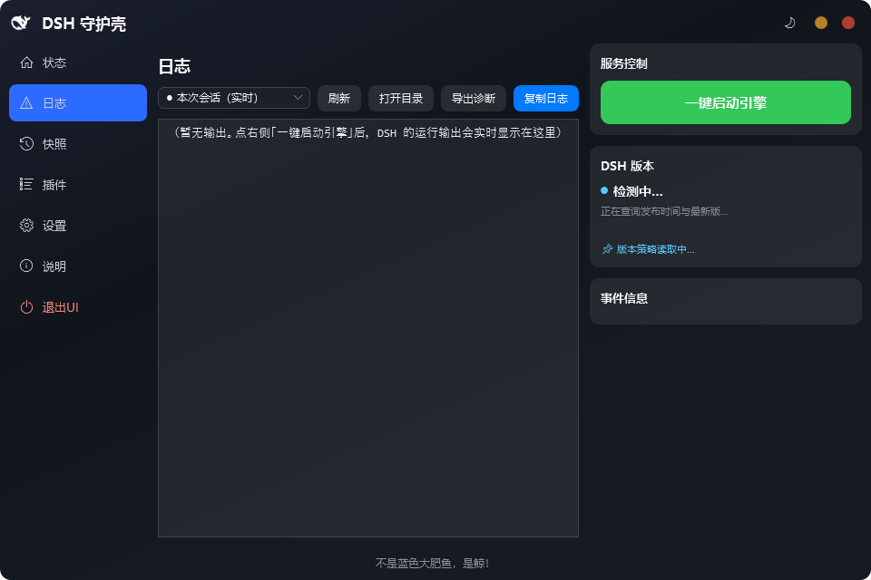
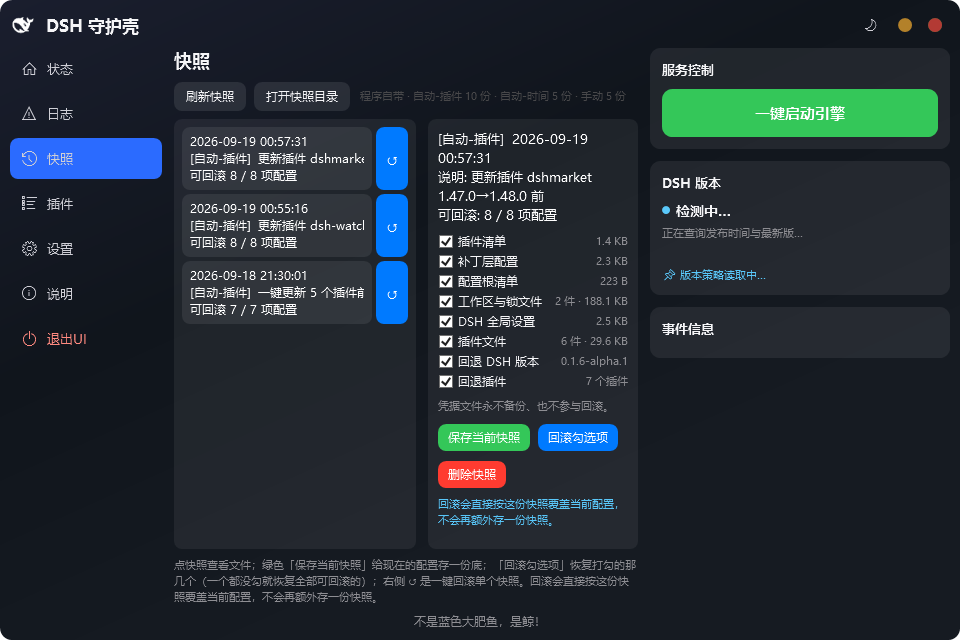
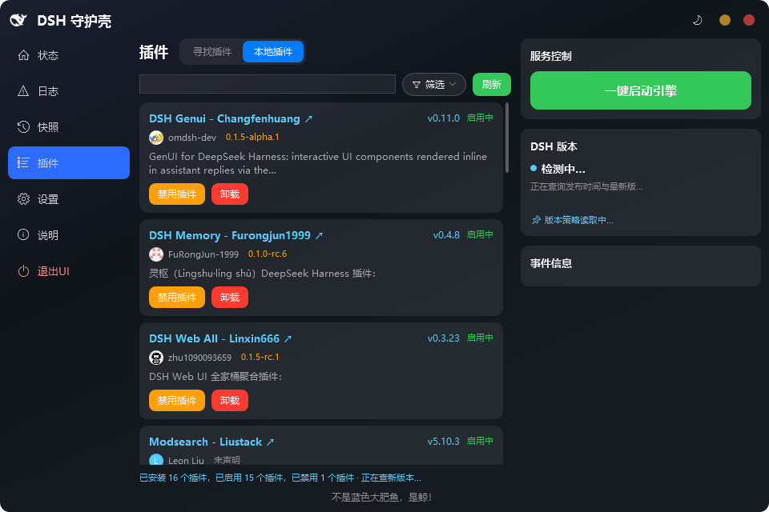
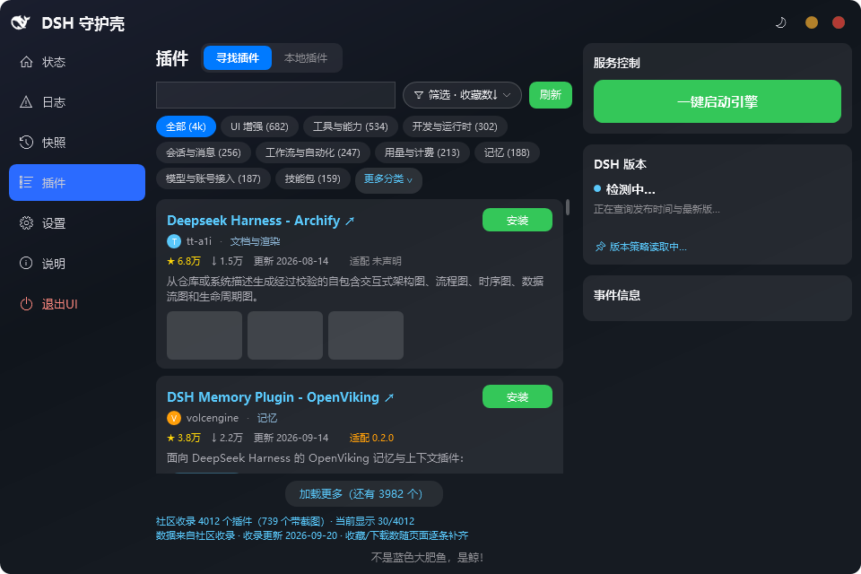
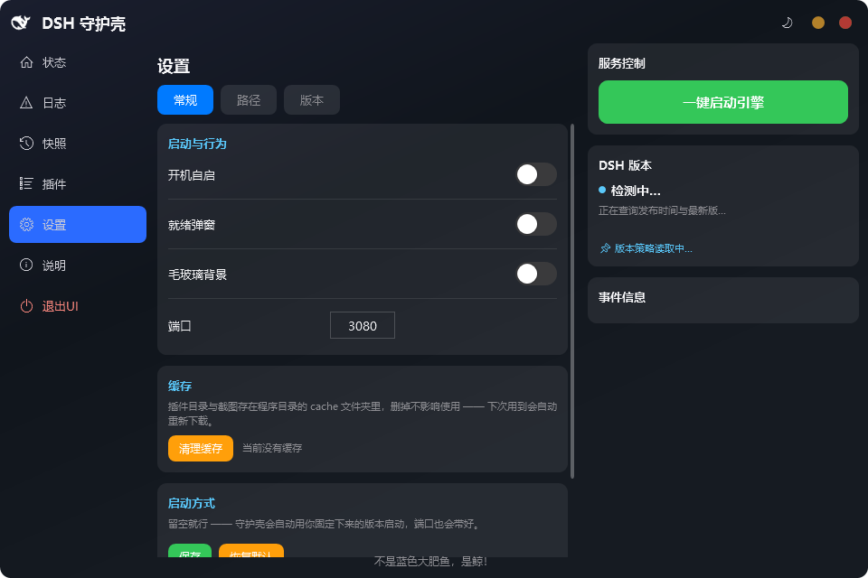
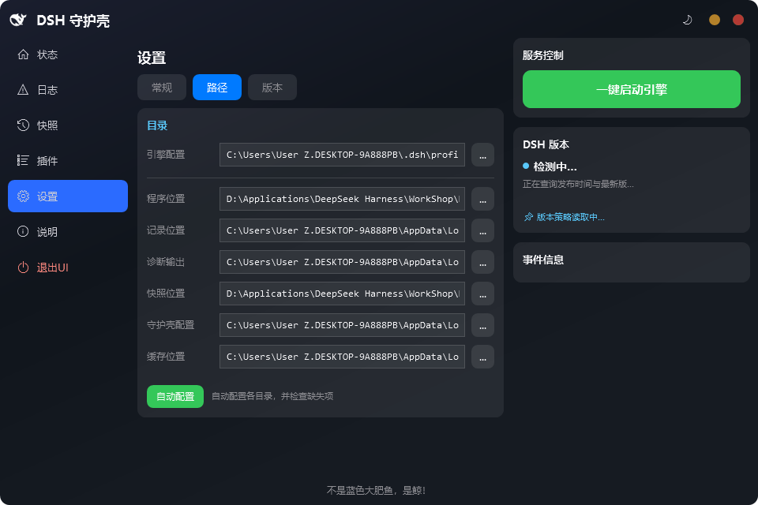
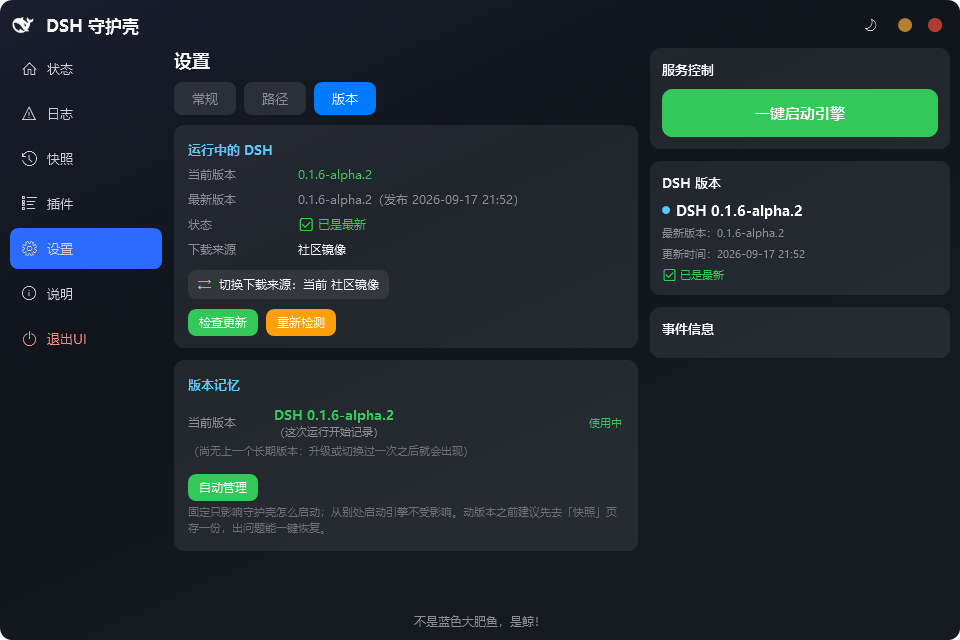
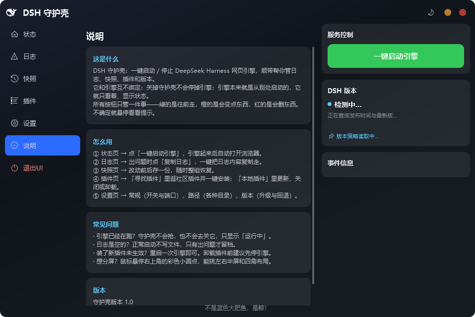

# DSH 守护壳（DSHGuard）

**给 DeepSeek Harness（DSH）网页引擎配的一个 Windows 桌面"守护壳"：一键启动与停止引擎、锁定版本、管理插件、改动前自动存档、出问题带走日志——全程图形界面，不需要命令行。**

它面向不熟悉命令行的用户：安装后双击启动，点按钮即可运行引擎；出现故障、卡顿或插件状态异常时，也能在同一个窗口里查看、存档并回退。

---

## 为什么会有它

我长期使用 DSH，把日常反复遇到的不便一条条记下来，最终做成这样一个一键管理式启动器。下面列出的就是当初要解决的问题，每一条在后面的功能章节里都能找到对应做法：

| 反复遇到的不便 | 守护壳里的对应做法 |
| --- | --- |
| 每次都要在终端里敲命令启动引擎，还要自己找端口、自己开页面 | 状态页的「一键启动引擎」，参见[状态页](#一状态页看到引擎在不在跑) |
| 引擎按上游标签安装，标签一动就跑成了另一个版本 | 版本记忆与「设置 → 版本」的升级、回退，参见[设置页](#五设置页常规路径版本) |
| 装了一堆插件，说不清谁在启用、谁被关掉、谁该升级 | 插件页的本地清单与社区收录，参见[插件页](#四插件页本地插件与寻找插件) |
| 改插件清单或配置之后出了问题，没有还原点可退 | 快照页的改动前自动存档与整组回滚，参见[快照页](#三快照页改动前存档出事回滚) |
| 引擎起不来时没有任何现场，不知道去哪看日志 | 日志页的实时输出、历史日志与「导出诊断」，参见[日志页](#二日志页看清引擎说了什么) |

设计原则是**只做看护，不做接管**：守护壳是独立程序，和 DSH 引擎是两回事。引擎原本由外部启动，守护壳只负责启动与监测，并在需要时处理现场。

---

## 它长什么样

左侧是导航栏，共六个页面（状态、日志、快照、插件、设置、说明），最下方是「退出UI」；右栏常驻三块信息：**服务控制**（当前可用的引擎操作）、**DSH 版本**（正在用的版本与最新版）、**事件信息**（最近发生了什么）。界面为全中文，标题栏右侧可切换日夜配色。



| 页面 | 管什么 |
| --- | --- |
| 状态 | 引擎在不在跑、跑的是哪个端口、最近输出与事件；右栏是一键启动与终止 |
| 日志 | 本次会话的实时输出、历史日志、导出诊断与复制日志 |
| 快照 | 改动前存档，随时按项或整组回滚 |
| 插件 | 「寻找插件」逛社区收录并安装；「本地插件」启停、更新、卸载 |
| 设置 | 常规（开关与端口）、路径（各种目录）、版本（升级与回退） |
| 说明 | 应用内说明与常见问题 |

---

## 一、状态页：看到引擎在不在跑

**它解决什么痛**：引擎原本要在终端里手动拉起，端口是不是对的、进程还活着没有，全靠自己确认。

**具体能做什么**

- 顶部状态卡显示当前状态：**引擎运行中**（附本次已运行时长）、**正在启动…**、**引擎未运行**。
- 显示引擎的访问地址与端口，一眼确认端口号是否与设置一致。
- 「实时输出」实时滚动引擎最近的输出，不用切到别的页面。
- 右栏「服务控制」按当前状态给出唯一正确的动作：未运行时是绿色「一键启动引擎」，启动中是带百分比的进度条，运行中是红色「终止引擎」与绿色「加载引擎」（重新打开浏览器页面）。
- 右栏「DSH 版本」显示当前运行的版本、最新版与版本策略；点击卡片可直接跳到设置页的版本页。
- 右栏「事件信息」记录本次使用发生过什么：启动、停止、设置变更、插件动作、失败与告警各按严重程度着色。



启动过程中进度条持续推进；即使引擎卡在某一阶段不动，进度也会缓慢向前爬，不会停在原地让人以为程序已经死了。

**注意点**

- 引擎已经在别处跑着时，守护壳只显示为运行中（外部引擎），**不会重复启动、也不会抢占端口**。
- 「终止引擎」会结束引擎进程，并中断正在进行的任务与对话。
- 引擎正托管守护壳本身时，「终止引擎」会先问一次：只解绑，或仍然终止。

---

## 二、日志页：看清引擎说了什么

**它解决什么痛**：引擎起不来时，窗口一闪就没了，用户手里没有任何现场，更不知道该把什么交给维护者。

**具体能做什么**

- 日志来源下拉：默认是「本次会话（实时）」，即本次运行正在产生的输出；也可切换查看历史日志文件。
- 「刷新」重新读取当前选中的日志来源。
- 「打开目录」直接在文件管理器中定位日志所在文件夹。
- 「导出诊断」把日志、配置与一份运行环境摘要打成一个压缩包，并给出保存位置。
- 「复制日志」把当前显示的内容一次性复制到剪贴板，便于粘贴到反馈里。



日志文件的分工与「出问题怎么办」，见下文[日志与诊断](#日志与诊断)。

**注意点**

- 引擎正常启动时**不会**留下日志文件，日志页一开头是空的属正常现象；只有真的出问题才留档。
- 诊断包的默认保存位置可在「设置 → 路径 → 诊断输出」中更改。

---

## 三、快照页：改动前存档，出事回滚

**它解决什么痛**：改插件清单或配置之后出问题，没有还原点，只能手工比对、逐步试错。

**具体能做什么**

- 左侧是快照列表，每一项显示存档时间、类型与说明，以及**可回滚的项数**。
- 右侧是选中快照的详情：改动按大类聚合成清单，逐项可勾选。
- 「保存当前快照」给现在的配置存一份底。
- 「回滚勾选项」恢复打勾的那几项；一个都不勾则恢复全部可回滚项。
- 列表项右侧的「↺」是单个快照的一键回滚。
- 「删除快照」删除该存档。
- 「刷新快照」与「打开快照目录」分别用于重新读取列表与定位存档目录。
- 快照按类型分别保留：插件动作前自动存、引擎每连续运行满 1 小时自动存、手动存档，各自有独立份数上限，超出时只裁剪本档最旧的。



**注意点**

- 回滚会**直接按这份快照覆盖当前配置**，不会再额外存一份快照。
- 详情清单里除了配置文件，还有两项可勾选的虚拟条目：**回退 DSH 版本**与**回退插件**；某项在当前机器上无法判定时，这一项会置灰不可勾选，并把原因写在悬停提示里。
- **凭据文件永不备份、也不参与回滚。**
- 快照与回滚都不会碰 DSH 自己的配置文件之外的内容。

---

## 四、插件页：本地插件与寻找插件

插件页顶部有两个页签，默认停在「本地插件」。

### 本地插件：已经装好的怎么管

**它解决什么痛**：插件一多，谁在启用、谁被关掉、谁有新版本、谁跟当前引擎版本合不来，全靠回忆。

**具体能做什么**

- 按名称、作者、说明搜索，并可按下拉里的条件筛选：兼容情况（完全兼容 / 基本可用 / 不兼容 / 未声明）、启用状态（启用中 / 已关闭）、有没有新版。
- 每张卡片显示插件名、作者、当前版本与启用状态，以及一段说明。
- 每张卡片可就地**「禁用插件」/「启用插件」**与**「卸载」**。
- 顶部「一键更新 N 个」把所有确有新版本的插件一次更新完；更新前自动打快照兜底。
- 「刷新」重新扫描本地插件并查询新版本。
- 底部汇总已安装、已启用、已禁用与可更新的数量。
- 勾选若干张卡片后可批量**禁用 / 启用 / 更新 / 卸载**；删除类动作会先列出将被处理的插件清单供确认。



**注意点**

- 启用或禁用、安装或卸载插件后，需要**重启 DSH 才会完全生效**；守护壳会在动作完成后询问是否现在重启。
- 卸载不可逆：包会被删除，需要重新安装才能再用。建议先停止引擎再卸载，避免文件被占用。
- 卡片上标注的兼容档来自插件自己声明的引擎版本要求；作者没有声明时显示为未声明，只能实测。

### 寻找插件：社区收录里逛一逛

**它解决什么痛**：想装插件时没有可浏览的入口，只能靠别人给的包名去猜。

**具体能做什么**

- 数据取自社区收录，可按下拉里的排序字段（下载量、收藏数、更新时间）与排序方向排列，并可按更新时间范围、是否适配当前引擎版本过滤。
- 分类标签栏按类别汇总条目数（例如 UI 增强、工具与能力、开发与运行时等），标签过多时可展开「更多分类」，也可收起。
- 每张卡片显示插件名、作者、收藏数、下载数、更新时间与声明的适配版本，附截图缩略图与说明。
- 卡片上的「安装」按钮一键安装；已在本机配置中的条目标注为已安装，并可打开其仓库地址。
- 列表底部的「加载更多」按页追加后续条目。



**注意点**

- 条目数、收藏数与下载数来自社区目录，随收录更新而变化；卡片上的收藏、下载数会随页面逐条补齐，刚打开时可能暂时为空。
- 安装同样会登记进 DSH 的插件清单，装错了可在「本地插件」里卸载；改动前会自动备份配置。

---

## 五、设置页：常规、路径、版本

### 常规：开关与端口

**它解决什么痛**：开机要不要自动跑起来、引擎就绪后浏览器要不要自己开、端口撞车了往哪改，这些零碎开关原本散落在各处，没有统一入口。

**具体能做什么**

- **开机自启**：随 Windows 登录自动启动守护壳（与安装时勾选的是同一处设置）。
- **就绪弹窗**：引擎就绪后自动打开浏览器页面。
- **毛玻璃背景**：半透明虚化效果；老机器或远程桌面觉得拖动发涩时可以关掉，换成纯色，关掉即刻生效。
- **端口**：引擎监听的端口，默认 3080；改动在引擎重启后生效。
- **缓存**：显示当前占用，并可「清理缓存」——清掉的是插件目录缓存与截图缓存，删掉不影响使用，下次用到会重新获取。
- **启动方式**：高级选项，留空即用守护壳默认的启动方式（自动带上固定版本与端口）；也可以自行指定，改动会原样执行。



### 路径：各种目录在哪

**它解决什么痛**：日志、快照、缓存、引擎配置分散在不同位置，要找的时候不知道去哪翻，想挪个地方也没有手段。

**具体能做什么**

- 逐项查看并修改目录：引擎配置、程序位置、记录位置、诊断输出、快照位置、守护壳配置、缓存位置。
- 每项都可直接编辑，或点右侧的「…」选择文件夹。
- 「自动配置」按当前机器重新识别各目录，并检查缺失项。



**注意点**

- **引擎配置**是 DSH 自己的配置目录（插件清单与配置文件都在其中），与下面的**守护壳配置**不是同一个。
- **程序位置**为只读显示，取决于程序实际安装在哪里。

### 版本：升级与回退

**它解决什么痛**：引擎按上游标签安装，标签一动，跑起来的就是另一个版本，行为跟着变。

**具体能做什么**

- 「运行中的 DSH」一栏显示当前版本、最新版本、发布时间与状态（已是最新 / 有新版本）。
- 「检查更新」查询最新版，若存在新版会先做一次插件兼容性体检，再让你决定是否升级。
- 「重新检测」重新查询一次。
- 「下载来源」一行可点击切换：社区镜像与官方源之间来回切换。
- 「版本记忆」一栏列出**当前版本**与**上一长期版本**，后者可一键「切换到它」。
- 版本策略在「自动管理」与「跟随最新版」之间切换：自动管理把现在跑着的这个版本固定下来，跟随时每次启动都联网取最新版。
- 同一版本连续多次启动异常时，守护壳会主动提示回退到上一个长期运行过的版本。



**注意点**

- 固定版本**只影响守护壳怎么启动引擎**；从别处启动的引擎不受影响。
- 动版本之前建议先去快照页存一份，出问题能一键恢复。
- 升级或回退后需要重启引擎才会生效。

---

## 六、说明页

应用内帮助：这是什么、怎么用、常见问题与当前版本号，都在这一页里，不需要另找文档。



---

## 七、退出UI 与托盘

- 左下角「**退出UI**」只退出守护壳界面，**不会停止引擎**。要停引擎请用状态页右栏的「终止引擎」。
- 标题栏右上角的关闭键等于收进系统托盘，程序继续在后台待命；双击托盘图标可以叫回窗口，托盘菜单里有「显示窗口」与「退出」。
- 标题栏右侧还有日夜配色切换；鼠标悬停在最大化按钮上可挑选半屏与四角布局。

---

## 怎么用

### 最省事：直接用安装包

1. 到本项目的 **Releases** 页面，下载最新的 `DSHGuard-Setup-<版本>.exe`。
2. 双击运行，按向导走完（默认装在当前用户的程序目录下，不需要管理员权限）。
3. 从开始菜单或桌面图标启动守护壳，点右上角「**一键启动引擎**」即可。

不需要自行准备 Node.js，也不需要敲任何命令——安装向导会检查运行环境，缺失时会给出提示，并可以代为安装（用户级、免管理员）。

### 或者：自己编译

需要 **.NET 10 SDK**（Windows 10/11 64 位）。在仓库根目录执行一条命令即可：

```powershell
dotnet publish -c Release
```

产物是单文件、自带运行时，双击就能用：

```
bin\Release\net10.0-windows\win-x64\publish\DSHGuard.exe
```

单文件、自包含、带压缩等发布参数都已经写在 `DSHGuard.csproj` 里，命令行不需要再传。想跑一遍自检或者打成安装包，见下面的「想提交贡献？」。

---

## 系统要求

- Windows 10 / 11（64 位）
- Node.js（长期支持版）。安装器可以代为安装：用户级安装、免管理员
- 可选的包管理器 pnpm（只有用到依赖 pnpm 的插件时才需要）
- 首次启动引擎时需要联网（引擎通过 npx 拉取并缓存）

用现成安装包的话，这些都不用手动准备；自己编译才需要 .NET 10 SDK。

---

## 安装

1. 运行 `DSHGuard-Setup-<版本>.exe`。
2. 选择安装位置（默认装在当前用户的程序目录下，任何机器都有写权限）。
3. 按需勾选附加任务：
   - **首次安装建议保留**：安装运行环境（Node.js 长期支持版，免管理员）。**只在系统里找不到 Node 时才出现**
   - **附加任务**：创建桌面快捷方式；开机自动启动本程序（之后可随时在程序内更改）
4. 完成后从开始菜单或桌面图标启动。安装包最后一步**不会**自动拉起程序——请自行启动，避免在安装收尾阶段就抢占系统资源。

---

## 首次使用

1. 打开守护壳，点右上角「**一键启动引擎**」。
2. 首次启动会稍慢（引擎需要下载并缓存），就绪后会自动打开浏览器页面。
3. 之后每次启动都按版本记忆里固定下来的版本走，不会再被上游标签变动影响。

引擎已经在别处跑着时，守护壳会识别出来，不会重复启动，也不会抢端口。

---

## 数据与文件位置

程序目录下会有这几样（都可以在「设置 → 路径」里改）：

| 目录 | 内容 |
| --- | --- |
| `Config` | 守护壳自己的设置与版本记忆 |
| `Cache` | 插件包与截图缓存，删掉不影响使用（下次用到会重新下载） |
| `Logs` | 日志（见下一节） |
| `Snapshots` | 快照存档 |
| `Tools` | 辅助脚本（例如安装 Node.js 用到的脚本） |

**守护壳以只读为主，不改 DSH 自己的配置目录**（`%USERPROFILE%\.dsh`）：引擎的配置、插件与会话数据都在那边，卸载时也一律不碰。

只有下面三种「发现明显损坏、且不动就会卡住」的情况，它才会在**先备份**之后动手，并在窗口的「事件信息」里说明改了什么：

| 情形 | 动作 |
| --- | --- |
| 补丁层配置文件（`cordis.patch.yml`）语法不合法、引擎会整份忽略它 | 备份后修正结构 |
| 插件清单里的包名写法有误（引擎会认不出该插件） | 备份后修正该条 |
| 本程序上次留下的组件联接已失效，会让引擎拒绝启动 | 删除这些**由本程序创建**的联接 |

**任何其它情况下，它都不会写入或删除 `%USERPROFILE%\.dsh` 里的内容**；「回滚快照」这种会覆盖配置的动作，也必须由用户明确点击才会执行。

---

## 日志与诊断

`Logs` 目录下有两类文件，分工明确：

- `异常-<日期>-<时间>.log`：**只记异常**。例如界面卡住超过若干秒、某个对话框长时间未关闭、启动失败。日常操作不会出现在这里。
- `启动-<日期>-<时间>.log`：**只在启动失败时留下**。留下时写清这一次用的工作目录、版本、命令行、预检结果、失败原因与引擎输出尾部——"为什么没起来"的答案基本都在这里。引擎起来（端口就绪）就没这份文件，连"第一次尝试失败、自动重试成功"的也一并撤掉：成功启动不留日志。

出问题时的推荐动作：**日志页 → 导出诊断**，得到一个压缩包，里面是上述日志、配置与一份运行环境摘要；把它发给维护者即可。

---

## 卸载

运行卸载程序（开始菜单的「卸载 DSH 守护壳」，或系统「设置 → 应用」）后：

1. 如果守护壳**正在运行**，会提示先退出它——这是刻意的：在进程运行时执行卸载只会留下不完整的安装。
2. 接着只问一件事：是否**保留我的设置、快照与日志（推荐）**，默认已勾选。
   - 保持勾选：只卸载程序本体，设置、快照、日志全部保留，以后重装可以接着用。
   - 取消勾选：卸载并删除全部数据，连程序文件夹一起删掉。
3. 无论哪种方式，都**不会**碰 DSH 自己的配置目录。

---

## 常见问题

**引擎起不来怎么办？**

先看 `Logs` 里最新那份启动日志（引擎没起来才会有它）：里面记了这一次的版本、工作目录、引擎输出的尾部。多数情况是网络不通（首次需要下载引擎）或 npm 缓存损坏——后者删掉 `Cache` 目录再试即可。引擎能正常启动时不会有这份日志，也不该有。

**第一次点「一键启动」特别慢？**

首次需要下载并缓存引擎，之后启动会快很多。

**端口被别的程序占了？**

在「设置 → 常规」把端口换掉；守护壳只在启动前检查，不会去抢别人的端口。

**「退出UI」和「终止引擎」有什么区别？**

「退出UI」只退出守护壳，引擎继续运行；「终止引擎」会真的结束引擎进程，仅在引擎正托管守护壳本身、或上次没停干净需要强杀时，才先弹窗确认一次。

**装了新插件没生效？**

重启一次引擎即可；卸载插件前建议先停止引擎。

**界面偶尔卡顿，或拖动窗口时响应迟滞？**

这是分层窗口（毛玻璃）合成的老问题。程序在切换主题或毛玻璃后会主动要求系统重画一次；真的卡住超过 5 秒，会记进异常日志，方便定位。老机器可以在「设置 → 常规」把毛玻璃背景关掉。

---

## 想提交贡献？

需要：.NET 10 SDK、Inno Setup 6（打包安装程序用）。

```powershell
# 发布单文件（产物：bin\Release\net10.0-windows\win-x64\publish\DSHGuard.exe）
dotnet publish -c Release

# 编译
dotnet build -c Release

# 自检（不显示窗口、不访问引擎、不写配置；退出码 0 = 全部通过）
bin\Release\net10.0-windows\win-x64\DSHGuard.exe --selftest

# 打包安装程序（产物在 dist\）
powershell -ExecutionPolicy Bypass -File installer\build-installer.ps1
```

源码结构（主要文件）：

| 文件 | 职责 |
| --- | --- |
| `App.xaml.cs` | 程序入口、单实例、模式分发（`--selftest` / `--shot` / `--uninstall`） |
| `MainWindow.*.cs` | 主窗口与各页面（状态、日志、快照、插件、设置、说明） |
| `ProcessManager.cs` | 引擎进程的启动、追踪与终止（工作目录、端口归属判定） |
| `VersionMemory.cs` | 版本记忆：固定版本、回退候选与近期性判断 |
| `GuardDialog.cs` | 统一样式的对话框（非模态，避免"点不动"的假卡死） |
| `Logger.cs` / `ProcessEnv.cs` | 日志分流与环境自净（临时目录归一） |
| `ProfileReset.cs` | 一键重置：把出问题的配置文件整体搬走并留备份 |
| `SelfTest.cs` | 自带冒烟自检（数百条断言，覆盖上面这些模块） |
| `installer\DSHGuard.iss` | 安装包与卸载程序的全部界面与逻辑 |

自检是这套程序的验收基线：任何改动之后都应当 `--selftest` 全绿再打包。

---

## 许可

本项目采用 **MIT 许可证**，全文见仓库根目录的 [`LICENSE`](LICENSE)。

```
Copyright (c) 2026 DSHGuard contributors
```

你可以自由使用、修改、分发，包括商业用途，只需保留版权与许可声明。软件按"现状"提供，不附带任何担保。
